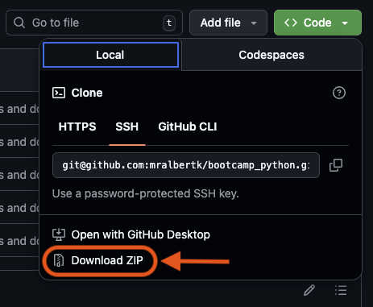
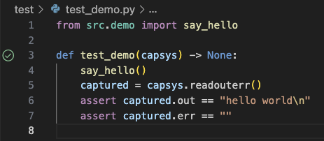
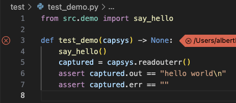

# Python Bootcamp Exercises

This repository contains exercises for the Python bootcamp class taught at DSTI.

## Prerequisites

- Python version 3.11 or later
- Visual Studio Code (recommended) or any other IDE

## Installation

Copy this repository to your local machine.

- If you are comfortable, use git: `git clone this-repo`
- Otherwise, download as .zip file and unpack locally:



## Set-Up

First, create a virtual environment for the project:

- In a terminal, navigate to the directory of this repository
- If using the basic Python virtualenv module: `python -m venv .venv`
- If using anaconda: `TBD`

Once your virtual environment is created, activate it:

- If using the Python venv module: `.venv\Scripts\activate`
- If using anaconda: `TBD`

**Important:** If you are using Windows and you get an error message, run the following command in the terminal window:

```
Set-ExecutionPolicy Unrestricted -Scope Process
```

Then install the project requirements locally:

- If using pip: `python -m pip install -r requirements.txt`
- If using anaconda: `TBD`

Finally, configure visual studio code to use the `pytest` library.

- Create the directory `.vscode` and the file `settings.json`:
    
    ```Powershell
    New-Item -Path ".vscode\settings.json" -ItemType File -Force
    ```
- Open the newly created `settings.json` file in visual studio code and insert the following:

    ```json
    {
        "python.testing.pytestArgs": [
            "test"
        ],
        "python.testing.unittestEnabled": false,
        "python.testing.pytestEnabled": true
    }
    ```

## Usage

This repository contains a set of exercises in the `src` directory and unit tests in the `tests` directory. It is designed so that you may autonomously complete the exercises and test if your answer is correct.

First, fill in the function in the prepared Python file. Pay close attention to the instructions because your function is expected to produce exactly the same output.

```python
# src/demo.py
def say_hello() -> None:
    """
    When called, this function prints 'hello world" to your terminal.
    
    Example:
        say_hello() prints "hello world" to the terminal.

    Parameters:
        None

    Returns:
        None
    """
    print("hello world")


# -- Do not modify code below this line
def main():
    say_hello()


if __name__ == "__main__":
    main()

```

Then, find the associated test file in `tests/` and run click the green `run` icon next to it. 

If your solution is correct, the test passes:



Otherwise, it fails:


