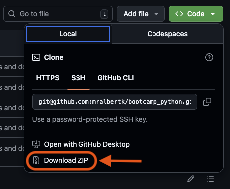

# Python Bootcamp Exercises

This repository contains support material for the Python bootcamp class taught at DSTI.

## Prerequisites

- Python version 3.11 or later
- Visual Studio Code (recommended) or any other IDE

## Installation

Copy this repository to your local machine.

- If you are comfortable, use git: `git clone https://github.com/mralbertk/bootcamp_python.git`
- Otherwise, download as .zip file and unpack locally:



## Set-Up

First, create a virtual environment for the project:

- If using the basic Python virtualenv module: 
    - In a terminal window, navigate to the directory of this repository: `cd path\to\repository`
    - Create the virtual environment: `python -m venv .venv`
- If using anaconda: 
    - Open the anaconda prompt
    - Create a new environment: `conda create --name bootcamp_env`

Once your virtual environment is created, activate it:

- If using the Python venv module: 
    - Make sure you are still in the repository:
    - Run this command: `.venv\Scripts\activate`
- If using anaconda: 
    - Make sure you are still in the anaconda prompt
    - Run this command: `conda activate bootcamp_env`

**Important:** If you are using Windows and you get an error message, run the following command in the terminal window:

```
Set-ExecutionPolicy Unrestricted -Scope Process
```

Then install the project requirements locally:

- If using the Python venv module: `python -m pip install -r requirements.txt`
- If using anaconda: `conda install --file requirements.txt`

## Usage

Find [Jupyter notebooks](https://jupyter.org/) with support material in the [`src/` directory](src/). 

You can run these in Visual Studio code or in a browser:

### Visual Studio Code

1. Open Visual Studio Code
2. Navigate to the directory you installed this repository in
3. Open the Notebook files and install required extensions if prompted

### Browser

- Navigate to your project directory, either in the Windows terminal or the anaconda prompt
- Make sure your virtual environment is active
    - In terminal: `.\.venv\Scripts\activate`
    - In anaconda: `conda activate bootcamp_env`
- Start the jupyter notebook server: `jupyter notebook`
- Your browser should open automatically, otherwise navigate to [http://localhost:8889/tree](http://localhost:8889/tree))
